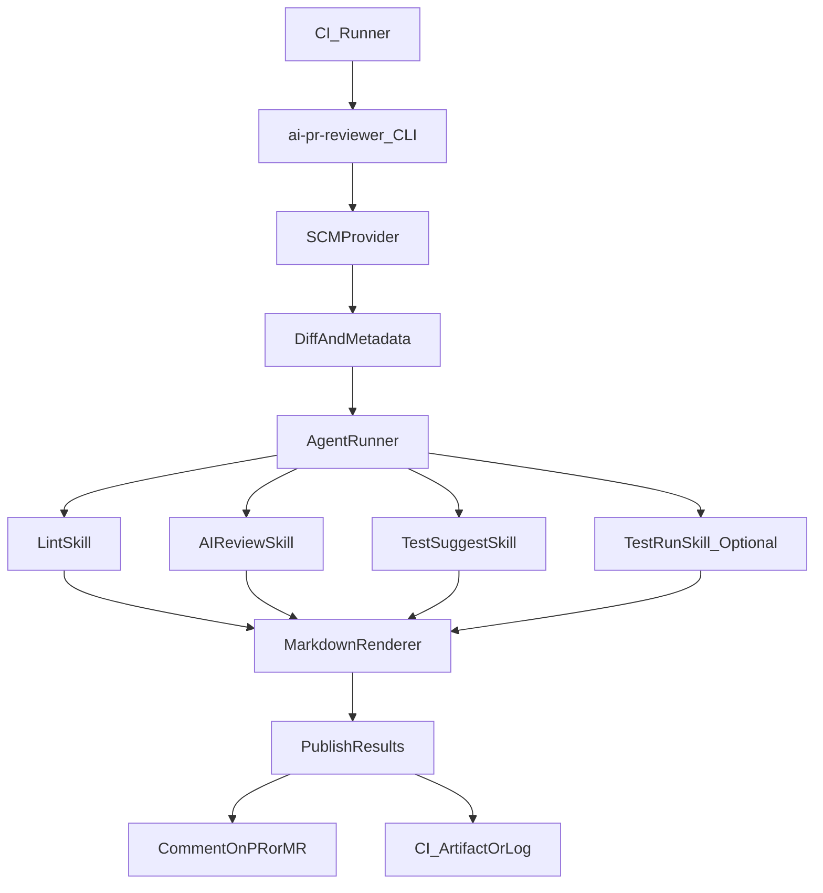

# AI PR Reviewer Agent (Portable)

An AI Agent + Skills system for reviewing Pull Requests / Merge Requests in **portable, multi-CI** environments. It is designed to be reused across projects via an **npm CLI core** plus **thin CI wrappers**.

## What it does
- **AI code review** on PR/MR diffs (chunked + budgeted) and publishes a **single markdown report**.
- **Suggests unit tests** for changed behavior (**comment-only**, never commits code).
- Optionally **runs unit tests** in CI and reports pass/fail + truncated logs.
- Supports **comment publishing** when the SCM provider allows it; otherwise exports results as **CI artifacts/log output**.

## Key design choices
- **Portable**: the core logic lives in a CLI so it can run on GitHub Actions, GitLab CI, Jenkins, etc.
- **No-write by default**: does not push commits or open follow-up PRs.
- **Guardrails**: file limits, patch limits, chunking, truncation, redaction.

## Architecture (high level)



## Configuration
Use one of:
- `.ai-pr-reviewer.yml`
- `ai-pr-reviewer.config.json`

Example `.ai-pr-reviewer.yml`:

```yaml
provider:
  kind: github # github | gitlab | bitbucket | azuredevops
  publish:
    mode: comment # comment | artifact

budgets:
  maxFiles: 20
  maxPatchChars: 6000
  maxChunks: 80

filters:
  include:
    - "**/*.{js,ts,jsx,tsx,py,go}"
  exclude:
    - "node_modules/**"
    - "dist/**"
    - "build/**"
    - "vendor/**"

ai:
  model: "gpt-4o-mini"
  temperature: 0

lint:
  command: "npm run lint"

tests:
  suggest: true
  run:
    enabled: true
    command: "npm test"
```

## CLI usage (concept)
The exact command set is designed to work both with and without an SCM API.

- `ai-pr-reviewer review` (auto-detect CI + provider when possible)
- `ai-pr-reviewer review-pr` (explicit PR mode, uses provider API)
- `ai-pr-reviewer review-mr` (explicit MR mode, uses provider API)
- `ai-pr-reviewer review-diff --patch <file|stdin>` (no provider required)

## CI examples

### GitHub Actions (PR)

```yaml
name: AI Review
on:
  pull_request:
    types: [opened, synchronize, reopened]

jobs:
  ai_review:
    runs-on: ubuntu-latest
    permissions:
      contents: read
      pull-requests: write
      issues: write
      models: read
    steps:
      - uses: actions/checkout@v4
      - uses: actions/setup-node@v4
        with:
          node-version: 20
      - run: npm ci
      - run: npx ai-pr-reviewer review
        env:
          GITHUB_TOKEN: ${{ secrets.GITHUB_TOKEN }}
```

### GitLab CI (Merge Request pipelines)

```yaml
stages: [review]

ai_review:
  image: node:20
  stage: review
  rules:
    - if: $CI_MERGE_REQUEST_IID
  script:
    - npm ci
    - npx ai-pr-reviewer review
  variables:
    # Provide a token with API permission to comment on the MR
    # e.g. a Project Access Token or a Bot user token
    GITLAB_TOKEN: $GITLAB_TOKEN
```

### Jenkins (Multibranch PR builds)

```groovy
pipeline {
  agent any
  stages {
    stage('AI Review') {
      steps {
        sh 'npm ci'
        sh 'npx ai-pr-reviewer review'
      }
      environment {
        // Inject credentials via Jenkins Credentials Binding
        GITHUB_TOKEN = credentials('github-token')
      }
    }
  }
}
```

## Security notes
- Use **least-privilege tokens** for commenting.
- Treat model prompts/outputs as potentially sensitive; enable redaction.
- For forked PRs, secrets exposure rules differ by platform—prefer comment publishing with constrained permissions or artifact mode.

## Troubleshooting
- If a PR is too large, reduce budgets or switch to summary mode.
- If commenting is not permitted, set publish mode to `artifact` and upload the markdown file in CI.
